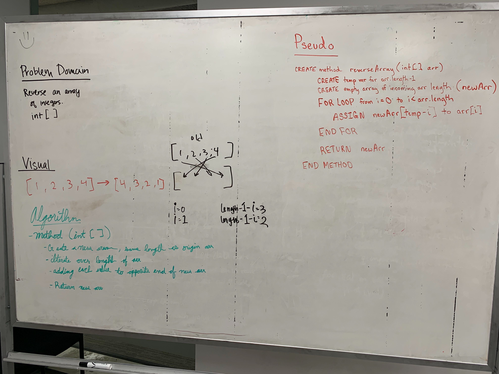

# Reverse an Array

## Challenge
Given an array of integers, we had to return an array with the contents reversed.

## Approach & Efficiency
First, we decided to create a new array that was the same length as the given array. Then we created a for loop that would iterate over the original array. For each number in the array, the value would be assigned to the new array in the opposite position. 

## Solution
Whiteboarded with Nicholas Paro and Chris Coulon

