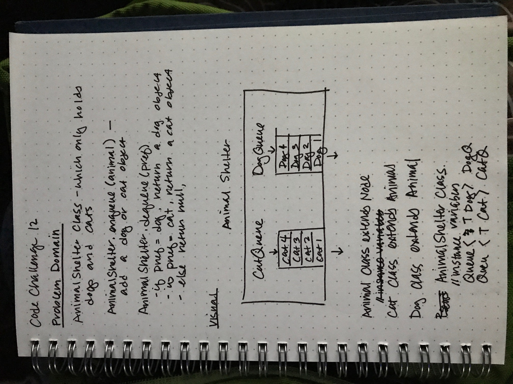

# Code Challenge 12: First-in, First out Animal Shelter

## Challenge
Create a class called AnimalShelter which holds only dogs and cats. The shelter operates using a first-in, first-out approach.

Implement the following methods:
- enqueue(animal): adds animal to the shelter. animal can be either a dog or a cat object.
- dequeue(pref): returns either a dog or a cat. If pref is not "dog" or "cat" then return null.

## Approach & Efficiency
- The AnimalShelter class will contain two queues as instance variables, one for dogs and one for cats
- When a dog or cat is enqueued, it will be added to the appropriate queue inside an AnimalShelter object
- When the dequeue method is called on an AnimalShelter instance, the preferred animal will be removed from one of the queues.

## Solution
[Code](https://github.com/janiekyu/data-structures-and-algorithms/blob/master/code401challenges/src/main/java/stacksandqueues/AnimalShelter.java) | [Test](https://github.com/janiekyu/data-structures-and-algorithms/blob/master/code401challenges/src/test/java/stacksandqueues/AnimalShelterTest.java)

