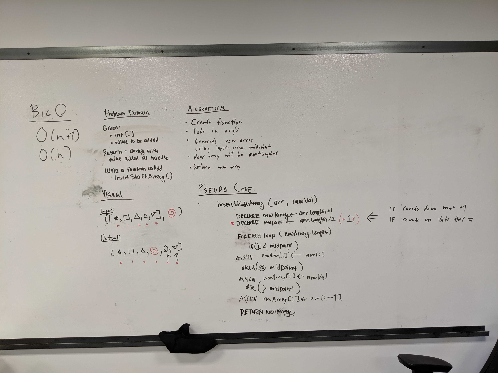

# Insert and shift an array in middle at index

## Challenge
Write a function called `insertShiftArray` which takes in an array and a new value to be added. The new value needs to be placed at the middle of the array. Return an array with the new value added. 

## Approach & Efficiency
- Create a new array with a length that is one greater than the given array
- Calculate the midpoint (index where new value is going)
- Start a for loop that will iterate over the new array
- Fill in the numbers before the midpoint using the values of the given array
- At the midpoint assign the value to be added
- Continue to fill in the rest of the array
- Return the new array

## Solution

[Code]()

Whiteboarded with Brandon Hurrington:

## Resources
- https://www.tutorialspoint.com/java/util/arrays_tostring_int
- https://stackoverflow.com/questions/3457941/using-assertarrayequals-in-unit-tests
