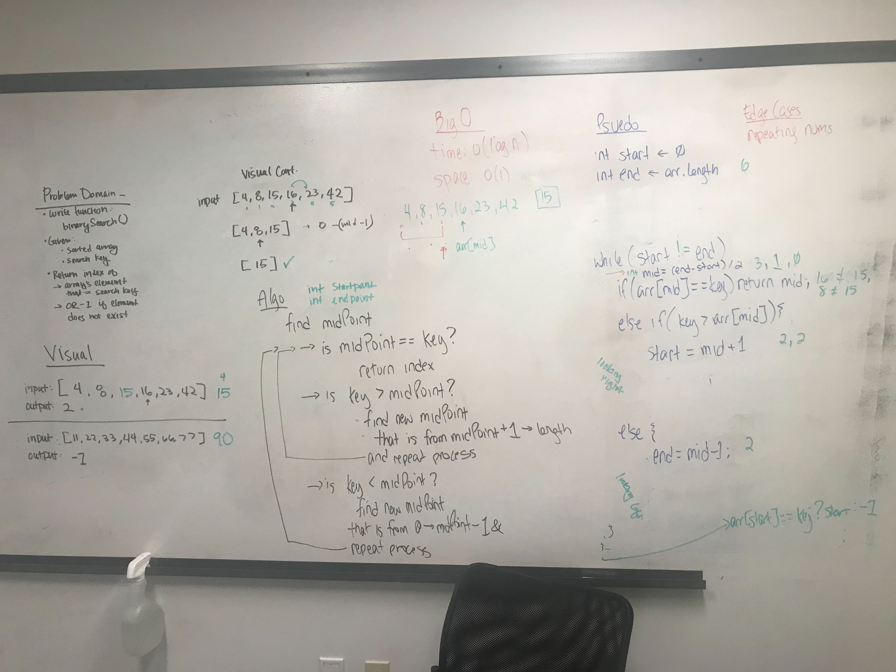

# Binary search in a sorted 1D array

## Challenge
Write a function called BinarySearch which takes in 2 parameters: a sorted array and the search key. Without utilizing any of the built-in methods available to your language, return the index of the array’s element that is equal to the search key, or -1 if the element does not exist.

## Approach & Efficiency
**Loop to divide the array and check for the key**
- Calculate the midpoint
- Compare key(k) to the value(m) at the midpoint
- Determine which half of the array to look at next

## Solution

[Code](https://github.com/janiekyu/data-structures-and-algorithms/blob/master/code401challenges/src/main/java/code401challenges/BinarySearch.java) | [Test](https://github.com/janiekyu/data-structures-and-algorithms/blob/master/code401challenges/src/test/java/code401challenges/BinarySearchTest.java)

Whiteboarded with Jackie Ly:

