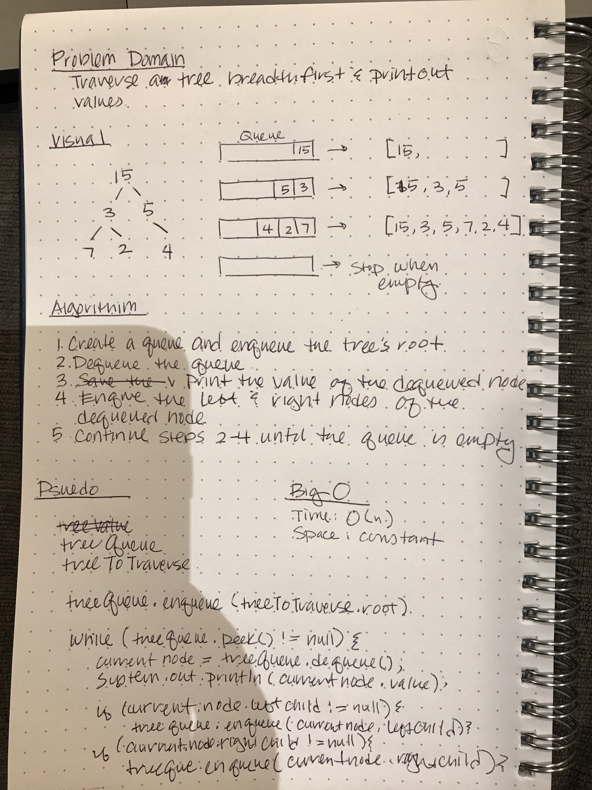

# Trees
Breadth-first Traversal

[Code](https://github.com/janiekyu/data-structures-and-algorithms/tree/master/code401challenges/src/main/java/code401challenges/tree/BreathFirst.java) | [Tests](https://github.com/janiekyu/data-structures-and-algorithms/tree/master/code401challenges/src/test/java/code401challenges/tree/BreathFirstTest.java)

## Challenge
Write a breadth first traversal method which takes a Binary Tree as its unique input. Without utilizing any of the built-in methods available to your language, traverse the input tree using a Breadth-first approach; print every visited node’s value.

## Approach & Efficiency
1. Create a queue and enqueue the tree's root
2. Dequeue the queue
3. Print the value of the dequeued node
4. Enqueue the left and right nodes of the dequeued node, if they exist
5. Continue steps 2-4 until the queue is empty

## Whiteboard

