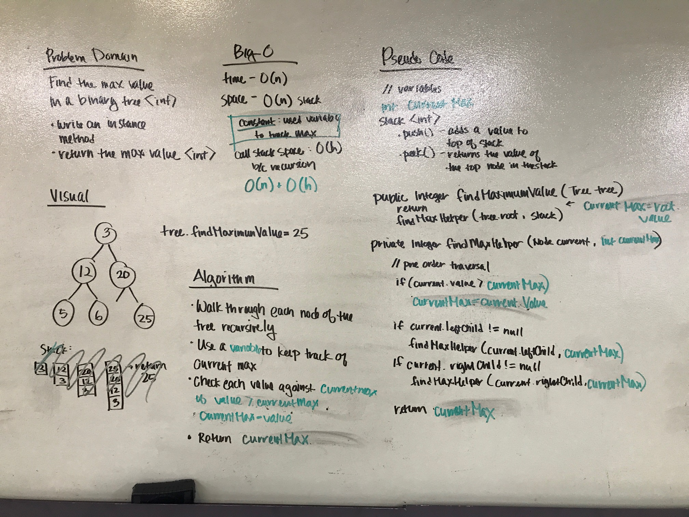

# Trees
Breadth-first Traversal

[Code](https://github.com/janiekyu/data-structures-and-algorithms/tree/master/code401challenges/src/main/java/code401challenges/tree.java) | [Tests](https://github.com/janiekyu/data-structures-and-algorithms/tree/master/code401challenges/src/test/java/code401challenges/tree/TreeFindMax.java)

## Challenge
Write an instance method called find-maximum-value. Without utilizing any of the built-in methods available to your language, return the maximum value stored in the tree. You can assume that the values stored in the Binary Tree will be numeric.

## Approach & Efficiency
1. Walk through each node of the tree recursively
2. Use an object (not a primitive variable) to keep track of the `current max`
3. Check each value against the `current max`
4. If the current value is greater than the `current max`, reset the `current max`
5. Return the `current max`

## Whiteboard

