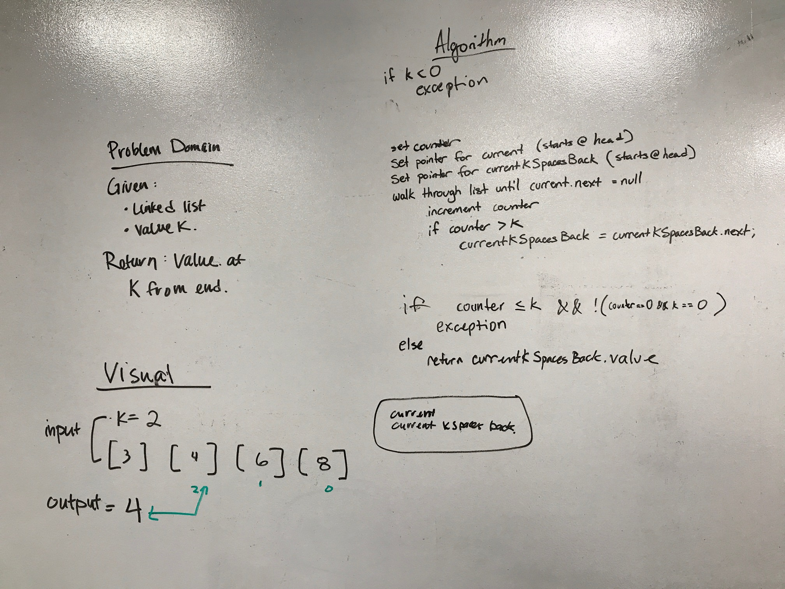

# Code Challenge 06: Linked list insertions

## Challenge
Write a method for the Linked List class which takes a number, k, as a parameter. Return the node’s value that is k from the end of the linked list.

## Approach & Efficiency
- Keep track of a current node and a node that is K number of spaces back from the current node
- Walk through the linked list until you find the end, then return the value of the node that is K number of spaces back

## Solution
[Code](https://github.com/janiekyu/data-structures-and-algorithms/tree/master/code401challenges/src/main/java/code401challenges/LinkedList) | [Test](https://github.com/janiekyu/data-structures-and-algorithms/blob/master/code401challenges/src/test/java/code401challenges/LinkedList/LinkedListTest.java)

Whiteboarded with Marisha Hoza:

## Solution

- //https://www.webucator.com/how-to/how-throw-an-exception-java.cfm
- //https://www.baeldung.com/junit-assert-exception
