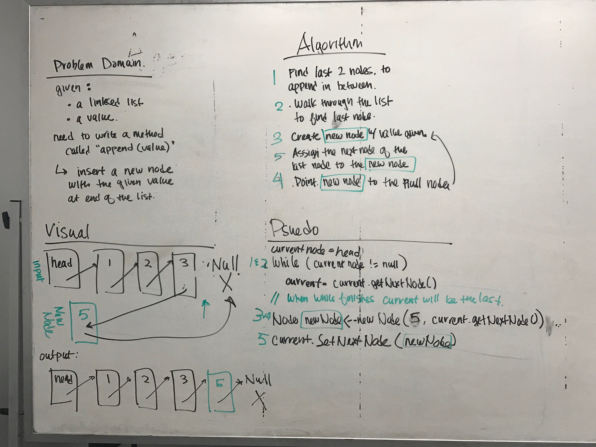
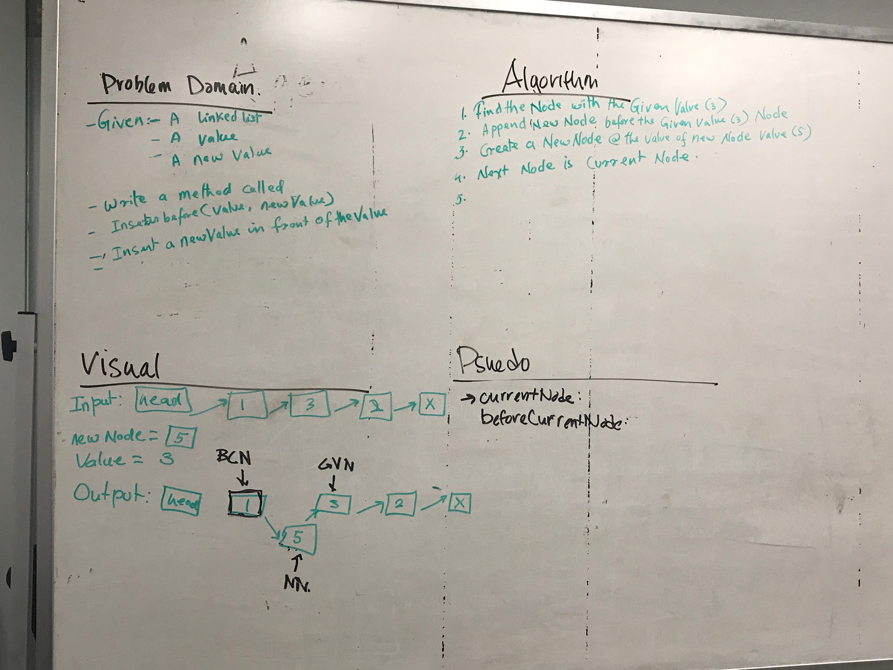

# Code Challenge 06: Linked list insertions

## Challenge
Write the following methods for the Linked List class:
- `.append(value)` which adds a new node with the given value to the end of the list
- `.insertBefore(value, newVal)` which add a new node with the given `newValue` immediately before the first `value` node
- `.insertAfter(value, newVal)` which add a new node with the given `newValue` immediately after the first `value` node

## Approach & Efficiency
- Walk through the linked list to find the location where the new node needs to be inserted
- Create the new node with given value and set the next node appropriately
- Set the next node properties of the nodes before and after the new node as needed

## Solution
[Code](https://github.com/janiekyu/data-structures-and-algorithms/tree/master/code401challenges/src/main/java/code401challenges/LinkedList) | [Test](https://github.com/janiekyu/data-structures-and-algorithms/blob/master/code401challenges/src/test/java/code401challenges/LinkedList/LinkedListTest.java)

Whiteboarded with Promila Tamang :

