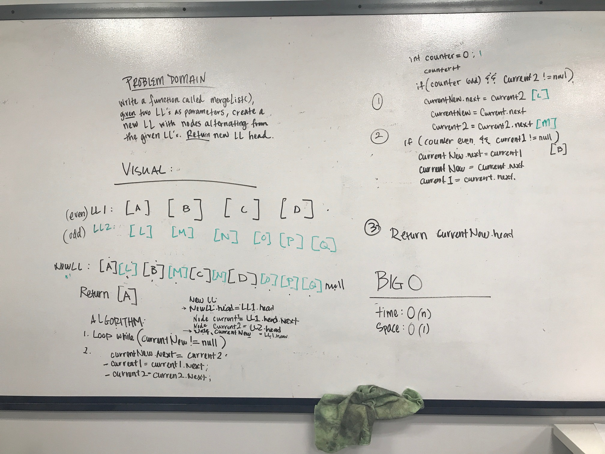

# Code Challenge 08: Merge two linked lists

## Challenge
Write a function called mergeLists which takes two linked lists as arguments. Zip the two linked lists together into one so that the nodes alternate between the two lists and return a reference to the head of the zipped list.

## Approach & Efficiency
- Create a new linked list
- Add nodes, alternating between the two given linked lists
- Update each node's pointer as they are added

## Solution
[Code](https://github.com/janiekyu/data-structures-and-algorithms/tree/master/code401challenges/src/main/java/code401challenges/LinkedList) | [Test](https://github.com/janiekyu/data-structures-and-algorithms/blob/master/code401challenges/src/test/java/code401challenges/LinkedList/MergedListTest.java)

Whiteboarded with Matt Stuhring:

