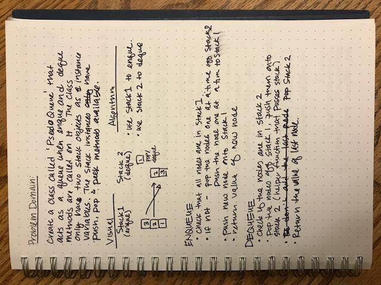
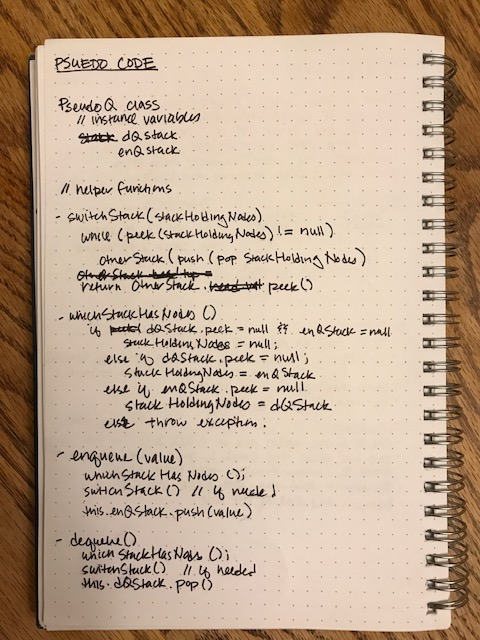

# Code Challenge 11: Implement a Queue using two Stacks

## Challenge
Create a new PsuedoQueue class that has two stacks as it's only instance variables. This new class will have two methods: enqueue(value) and dequeue(). When these methods are called on an instance of the PsuedoQueue class, the object should behave like a queue.

## Approach & Efficiency
- One of the stacks will be used to enqueue new nodes
- When a PsuedoQueue instance needs to be dequeued, nodes will be popped off the first stack and pushed onto the second stack one at a time. Then the pop method can be called on the second stack.
- If a new item needs to be added again to the list, the nodes will be moved back into the first list

## Solution
[Code](https://github.com/janiekyu/data-structures-and-algorithms/blob/master/code401challenges/src/main/java/stacksandqueues/PseudoQueue.java) | [Stack](https://github.com/janiekyu/data-structures-and-algorithms/blob/master/code401challenges/src/test/java/stacksandqueues/PseudoQueueTest.java)

